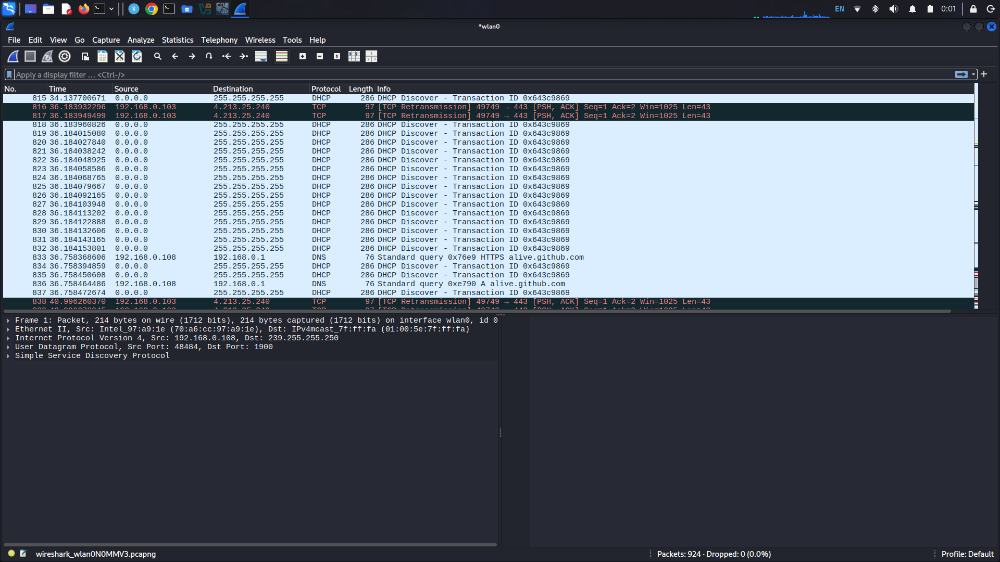

# DHCP Starvation Attack Analysis using Yersinia & Wireshark

This project demonstrates a **DHCP Starvation Attack** conducted in a controlled lab environment using the network tool **Yersinia**. The attack traffic was captured and analyzed using **Wireshark** to understand protocol vulnerabilities and identify indicators of compromise (IoCs).

---

## 🔍 Attack Mechanics & Vulnerability

The Dynamic Host Configuration Protocol (DHCP) operates on an implicit trust model. It does not natively authenticate the source of a network request. 

In a **DHCP Starvation Attack**, an attacker exploits this by flooding the local broadcast domain with thousands of malicious `DHCP DISCOVER` requests. For every request, the attacker generates a randomized, spoofed **Source MAC address**. 

The DHCP server treats each request as a unique, legitimate device and responds by reserving an IP address from its pool. Within seconds, the server's pool of assignable IP addresses is completely exhausted (starved).

### Impact:
* **Denial of Service (DoS):** Legitimate, new devices joining the network cannot obtain an IP address and are locked out of the network.
* **Man-in-the-Middle (MITM) Preparation:** Once the legitimate DHCP server is exhausted, the attacker can deploy a **Rogue DHCP Server** to hand out malicious gateway and DNS configurations to unsuspecting clients.

---

## 📊 Packet Analysis & Wireshark Proof

Below is the packet capture showing the attack in progress:

### Key Evidence Observed in the Capture:

1. **High Volume Broadcast Traffic:** 
   Multiple `DHCP DISCOVER` packets are sent within milliseconds of each other, targeted directly at the local broadcast destination address `255.255.255.255`.
   
2. **Anomalous Source IPs:** 
   The packets originate from a Source IP of `0.0.0.0`, which is normal for an initial handshake but highly suspicious when repeated in an intense flood.

3. **Repeated Transaction IDs (XIDs):** 
   In this specific capture snippet, the tool can be seen reusing a fixed Transaction ID (`0x643c9869`). A high volume of discovery packets sharing the exact same XID from a single physical interface is a strong indicator of automated network tooling / spoofing.

---

## 🛡️ Mitigation Strategies

To secure enterprise networks against DHCP starvation, network engineers deploy the following Layer 2 security features on managed switches:

* **DHCP Snooping:** 
  Configures switch ports as either "trusted" (connected to legitimate DHCP servers) or "untrusted" (connected to general user endpoints). The switch will instantly drop any inbound DHCP server messages or suspicious rate-limited requests arriving on untrusted ports.
  
* **Port Security:** 
  Restricts the maximum number of unique MAC addresses allowed to communicate through a single physical switch port. If Yersinia attempts to spoof hundreds of MAC addresses on a port restricted to a maximum of 2, the switch will immediately change the port state to `err-disabled`, shutting down the attack instantly.

---
*Disclaimer: This project was created strictly for educational purposes and authorized penetration testing analysis inside an isolated lab environment.*
